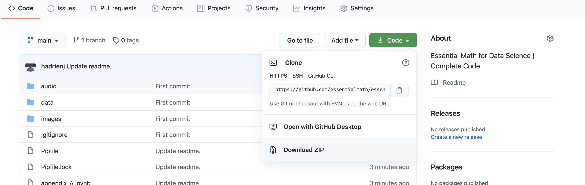

Welcome to *Essential Math for Data Science*! 🚀

You'll find here the notebooks with the code corresponding to each chapter of the book. You might gain a lot of insights by running the code as you read the book. It permits you for instance to check the shapes of your Numpy arrays, to look at the variables and see what's inside, to run interactive plots with `%matplotlib notebook`, and so on.

# Getting Started

Jupyter Notebooks are documents that contain runnable code cells and text. The format is great to have code and explanations at the same place. To run these Jupyter Notebooks, you'll need:

- A local version of the notebooks, cloned from the Github repository.
- A working Python 3 installation.
- A virtual environment with all the required Python libraries installed.

Let's start with the setup!

## Getting the Notebooks

Clone the repository to have the code on your computer. Alternatively, you can download the Github repository that contains the notebooks:



Click the `clone` button and then download the `.zip`. Then, unzip the file, open a terminal, and go to that folder:

```bash
cd essentialmath-main
```

## Python

First, you'll need to have a working Python 3 installation on your computer 🐍. I recommend the instructions from [The Hitchhiker's Guide to Python](https://docs.python-guide.org/). You'll find all you need for [Mac OS X](https://docs.python-guide.org/starting/install3/osx/), [Linux](https://docs.python-guide.org/starting/install3/linux/), and [Windows](https://docs.python-guide.org/starting/install3/win/).


## Virtual Environment

Virtual environments are used to install specific Python libraries (in specific versions) for a project. This avoids conflicts if you need different versions of Python or of a library in two projects. A great way to setup virtual environments is to use [pipenv](https://github.com/pypa/pipenv). Follow the instructions [here](https://docs.python-guide.org/dev/virtualenvs/) if needed.

You can now install the libraries (it also creates the virtual environment):

```bash
pipenv install
```

This will install all the libraries listed in the `Pipfile.lock` file. Note that you'll need to run your Python commands in the virtual environment to have access to the libraries using `pipenv run...`.

Finally, you can start the notebook server from the virtual environment `pipenv` as following:

```bash
pipenv run jupyter notebook
```

It should start a web page listing the files in the repository. You can then open the notebook you want (the `.ipynb` files).


# The Notebooks

Some notebooks use external datasets that I gathered here in the folder `data`. However, to run the hands-on project about PCA (Chapter 09), you'll need to download the database (as explained in the text).

Each notebook starts with a cell containing the imports, then you'll see a cell containing latex commands (appearing as an empty markdown cell). You'll also need to run it to have the commands available and the right text formatting.


You'll see cross-references in the text, like for instance: "Section 2.3". The first number tells you the Chapter number so you can find the right notebook and go look in it for more details.


# Ask Questions as Issues

One of the perks to have subscribed to *Essential Math for Data Science* is that you can speed your learning up by asking questions about anything you have trouble to understand in the book 🧐. Don't be shy, there is no bad question!

For each of these questions, fill an issue with a meaningful title and I'll try my best to help you and guide you to remove your blockers.

You can also participate in discussions and add your opinion or clarifications to other people's answer.

# Feedback

You can also give me your feedback, comments, erratas, and all things that you think could improve the book. The best way is also to use issues for this purpose.

Feedback are so helpful for me 🙏, it will help me make this book even better!
